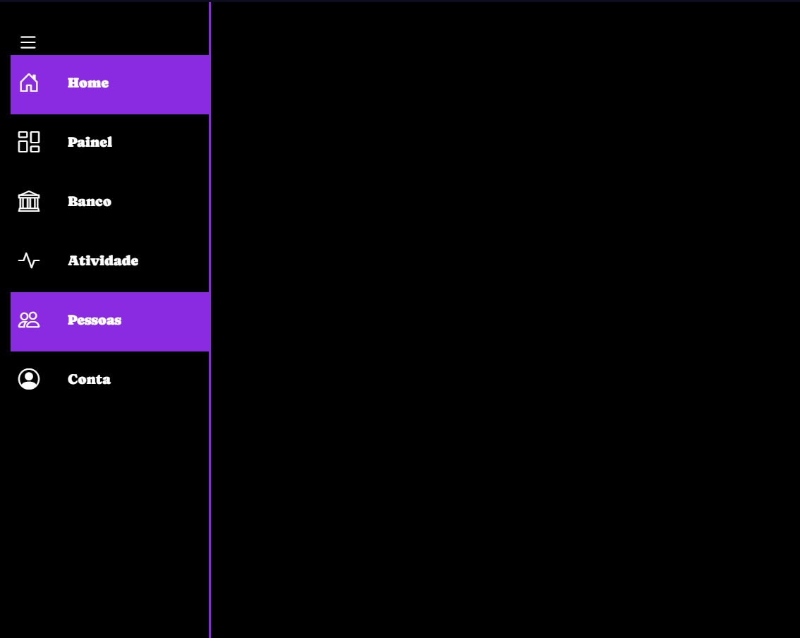

<h1 align="center"> Projeto SideBar </h1>

Programa para estudo de css e html simples de tecnologias Web sobre como fazer e estilizar uma sidebar.  

  <a href="#-tecnologias">Tecnologias</a>&nbsp;&nbsp;&nbsp;|&nbsp;&nbsp;&nbsp;
  <a href="#-projeto">Projeto</a>&nbsp;&nbsp;&nbsp;|&nbsp;&nbsp;&nbsp;
  <a href="#memo-licença">Licença</a>

  

 

  

## 🚀 Tecnologias

Esse projeto foi desenvolvido com as seguintes tecnologias:

- HTML e CSS
- JavaScript
- Git e Github

## 💻 Projeto

O projeito Receita é um projeto feito para revisar e exercitar conceitos de programação web.

- [Acesse o projeto finalizado, online](https://crissalves.github.io/Sidebar/)

## :memo: Licença

Esse projeto está sob a licença MIT.

---

- [Conheça mais sobre min e meu trabalho aqui](https://crissalves.github.io/Projeto-Devlinks/)
